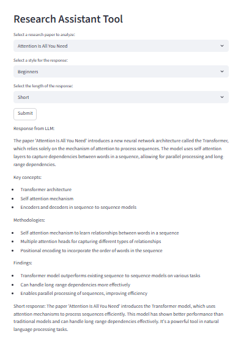

# 📚 Research Assistant App 

This is a small project I made using **LangChain**, **Streamlit**, and **OpenAI**, where I tried out a method called **template-based dynamic prompting** to build a smarter LLM app.

---
## Screenshot
Here is what the app looks like when running:

---
## 📌 What is Template-Based Prompting?

Usually, when we use ChatGPT, we type a full question every time ,that's called a **static prompt**. But in this project, I used a **template-based prompt**, where I define a prompt once and leave **placeholders** for the parts that change.

Instead of writing the whole prompt manually every time, I created a **prompt template** like this:
'Summarize the paper '{paper_input}' and provide a {length_input} response in a {style_input} style.
Make sure to include key concepts, methodologies, and findings. Include any relevant equations or mathematical expressions if applicable'

Then, I let the user choose the values for paper_input, style_input, and length_input from dropdowns in the UI.

---

## 🧪 How It Works (Step by Step)

1. I used **Streamlit** to make a simple UI with 3 dropdowns:
   - Choose a research paper
   - Choose the style (like beginner or technical)
   - Choose how long the answer should be (short, medium, long)

2. These inputs are passed into a **LangChain prompt template** that has placeholders.

3. The final prompt is generated by replacing the placeholders with the actual user inputs.

4. That full prompt is sent to **OpenAI’s ChatGPT model** to get the response.

5. The response is shown back to the user in the Streamlit app.

---

If we add some examples in the prompt template, it becomes a single-shot example or a few-shot prompt, depending on how many examples we include.

