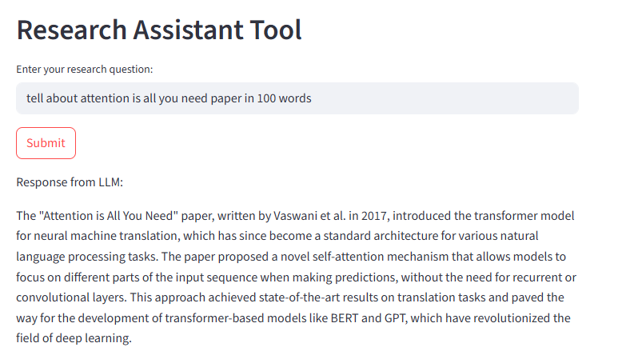

# 📚 Research Assistant App 
file: Static_prompt_ui.py

This is a simple app I built to test how a language model (LLM) responds to different user questions.
## Screenshot
Here is what the app looks like when running:

## 💡 How It Works

- I type a question into the input box  
- Click the **Submit** button  
- A new model instance is created  
- My input is sent to the model  
- The response is displayed on the screen

To ask another question, I just enter new text and click submit again. The same process repeats each time.

## ⚙️ Static Prompt Design

This app uses **static prompts**, meaning:
- The model only sees the current input
- It does not remember previous questions or answers
- The output depends entirely on the user’s prompt

This kind of static prompt appplications are not flexible

