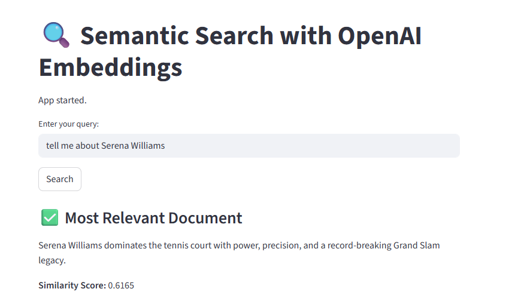

# Semantic Search App using OpenAI Embeddings
This is a simple Streamlit app I made to try out semantic search with OpenAI embeddings. You type in a query, and it finds the most relevant document from a small list based on meaning, not just keywords.
5 documents are sent as a input. Each document and query is converted to a embedding vector and semantic search is done. This app does not generate an answer or summary based on those documents using a language model like GPT.
---
## Screenshot
Here is what the app looks like when running:


## What it does
- Uses OpenAI's `text-embedding-3-small` model to convert text into vectors
- Calculates similarity between your query and some example docs
- Shows the closest matching document and similarity scores for all docs
- Built with Streamlit so it has a simple interactive UI

---
## Benefits of Langchain in this scenario
 Batching

Without Langchain, OpenAi supports batching but, each request has a token limit. If I send too many tokens in one batch, then the API fails.
When I call embed_documents(documents), LangChain internally checks how many tokens each document has and groups them. so that the total tokens per request stay within OpenAI's limit (like 8192 tokens).
If I pass 100 documents, LangChain might break them into batches and send separate API requests automatically.If an API call fails (e.g., due to too many requests), LangChain will retry with exponential backoff.
The output embeddings are returned in the correct order.

## How to run it
1. Install required packages:
```bash
 pip install -r requirements.txt


